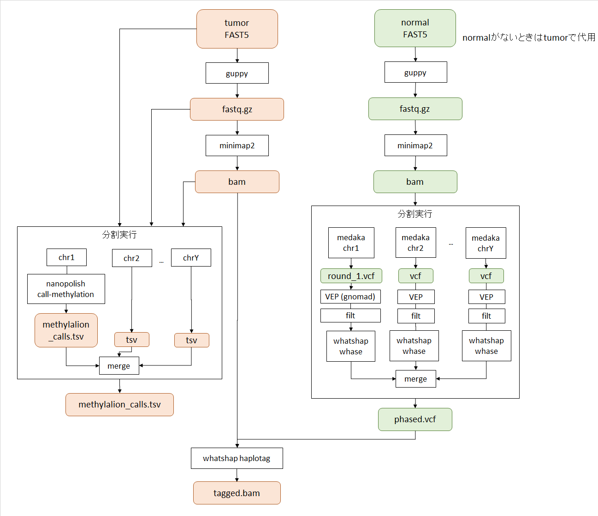

# nanopore_workflow_scripts

## setup

1. このリポジトリをダウンロード

2. pull singularity image

```
singularity pull docker://aokad/minimap2:2.17
singularity pull docker://aokad/medaka:20201224-cpu
singularity pull docker://ken01nn/nanopolish:latest
```

3. リファレンスゲノムをダウンロード

4. scriptのパスを編集

script/common/*.sh
```
REFERENCE=xxx
```

script/sample/singularity_*.sh
```
IMAGE=xxx
SCRIPT_DIR=xxx
OUTPUT_ROOT="固定ならここで変えておく"
```

## run

実行フロー



※1 guppyは終了しているものとする  
※2 vepによるフィルタリングはまだ無い  
※3 nanopolishの結果マージはまだ無い  
※4 whatshap phaseの結果マージはまだ無い  

1. scripts/sample ディレクトリをコピー

サンプルのパスに合わせてスクリプトのパスを編集する。  
tumorとnormalサンプルがある場合は以下のように配置する。

```
sample1_tumor
 - run_nanopolish.sh
 - singularity_minimap2.sh
 - singularity_nanopolish.sh
 - singularity_whatshap_haplotag.sh

sample1_normal
 - run_medaka_cpu.sh
 - run_whatshap_whase.sh
 - singularity_medaka_cpu.sh
 - singularity_minimap2.sh
 - singularity_whatshap_phase.sh
```

2. minimap2

qsubで投入

```
qsub ./script/singularity_minimap2.sh
```

3. nanopolish

以下で投入

```
run_nanopolish.sh
```

4. medaka

以下で投入

```
qsub run_medaka_cpu.sh
```

5. whatshap phase

以下で投入

```
qsub run_whatshap_phase.sh
```

6. whatshap haplotag

qsubで投入

```
qsub singularity_whatshap_haplotag.sh
```

