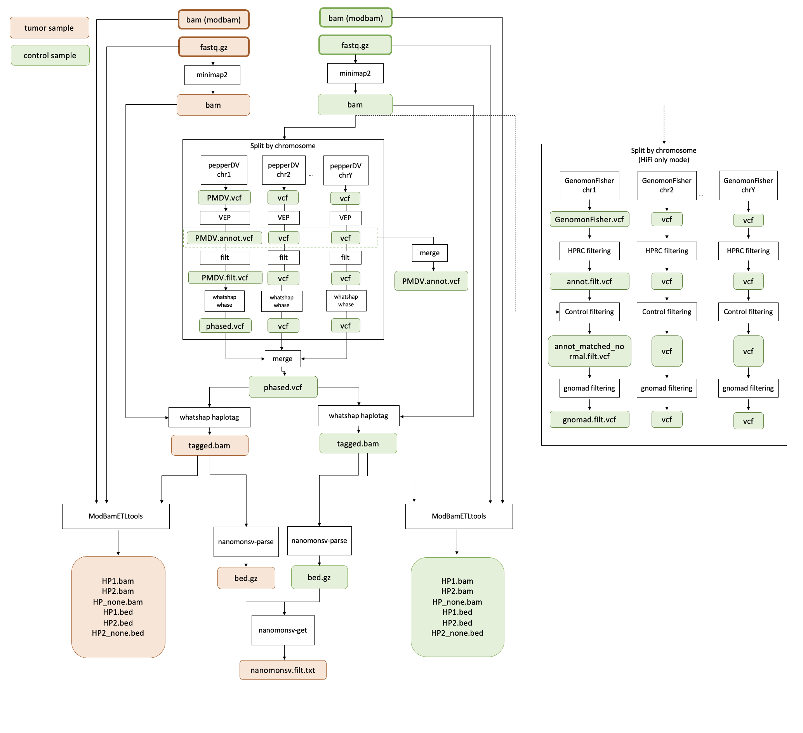

# nanopore_workflow_scripts

## Set Up

1. このリポジトリをダウンロード

```
wget https://github.com/ncc-ccat-gap/nanopore_workflow_scripts/archive/refs/heads/main.zip
unzip main.zip
```

2. prepare singularity image
- minimap2
- nanomonsv 
- pepper_deepvariant
- ensembl-vep
- whatshap
- Genomonfisher
- ModBamETLtools

```
singularity pull docker://aokad/minimap2:2.24
singularity pull docker://aokad/nanopolish:0.14.0
singularity pull docker://friend1ws/nanomonsv:v0.7.0b1
singularity pull docker://kishwars/pepper_deepvariant:r0.8
singularity pull docker://aokad/ensembl-vep:20220216
singularity pull docker://aokad/whatshap:1.5
```

3. リファレンスゲノムをダウンロード

4. 設定ファイルを編集

conf/param.sh
```
CONF_XXX_IMG=/path/to/image.sif
CONF_XXX_REFERENCE=/path/to/reference.fasta
```

## Run

実行フロー



※1 guppyはbasecall, modbasecallを終了しているものとする  

### run.sh を使用する場合

conf/sample.sh  (1ファイル1ペアのみ)
```
PARAM_TUMOR=TUMOR_NAME
PARAM_CONTL=CONTROL_NAME

PARAM_TUMOR_FASTQ=/path/to/tumor.fastq.gz
PARAM_CONTL_FASTQ=/path/to/control.fastq.gz

PARAM_TUMOR_BAM=/path/to/tumor_mod.bam
PARAM_CONTL_BAM=/path/to/normal_mod.bam

# Yes or No
METHYLATION_FLAG="Yes"


SCRIPT=/path/to/run.sh
```

ジョブ投入
```
cd {this repository}
bash run.sh conf/sample.sh
```

### snakemake を使用する場合
**Snakemake-related files have not updated from the previous version, so you can use run.sh to use this pipeline**

config.yml  (複数サンプル登録可能)
```
pair:
  TUMOR_NAME1: CONTROL_NAME1
  TUMOR_NAME2: CONTROL_NAME2
  TUMOR_NAME3: CONTROL_NAME2     # CONTROLの重複可能

fastq:
  TUMOR_NAME1:
  - /path/to/tumor1.fastq.gz
  TUMOR_NAME2:
  - /path/to/tumor2.fastq.gz
  TUMOR_NAME3:
  - /path/to/tumor3.fastq.gz
  CONTROL_NAME1:
  - /path/to/control1.fastq.gz
  CONTROL_NAME2:
  - /path/to/control2.fastq.gz

fast5:
  TUMOR_NAME1:
  - /path/to/tumor1/fast5_directory
  TUMOR_NAME2:
  - /path/to/tumor2/fast5_directory
  TUMOR_NAME3:
  - /path/to/tumor3/fast5_directory
  CONTROL_NAME1:
  - /path/to/control1/fast5_directory
  CONTROL_NAME2:
  - /path/to/control2/fast5_directory
```

snakemake実行
```
cd {this repository}
snakemake --cores 8 -k
```

## Output Files
```
{This repository}
#   Files originally in this repository
|-- config.yml
|-- snakefile.txt
|-- conf/
|   |-- param.sh
|   `-- sample.sh
|-- script/
|
#   Output
|-- log/
|   |-- CONTROL_NAME/
|   `-- TUMOR_NAME/
|-- minimap2/
|   |-- CONTROL_NAME/
|   |   |-- CONTROL_NAME.bam
|   |   `-- CONTROL_NAME.bam.bai
|   `-- TUMOR_NAME/
|       |-- TUMOR_NAME.bam
|       `-- TUMOR_NAME.bam.bai
|-- nanomonsv/
|   |-- CONTROL_NAME/
|   `-- TUMOR_NAME/
|       |-- TUMOR.nanomonsv.result.txt
|       |-- TUMOR.nanomonsv.result.vcf
|       |-- TUMOR.nanomonsv.sbnd.result.txt
|       `-- TUMOR.nanomonsv.supporting_read.txt
|-- methylation
|   |-- CONTROL_NAME/
|       |-- Control.export_taginfo.txt
|       |-- Control.export.fastq
|       |-- Control.HP1.bam
|       |-- Control.HP2.bam
|       |-- Control.HP_none.bam
|       |-- Control.HP1.bam.bai
|       |-- Control.HP2.bam.bai
|       |-- Control.HP_none.bam.bai
|       |-- Control.HP1.bed.gz
|       |-- Control.HP2.bed.gz
|       `-- Control.HP_none.bed.gz
|   `-- TUMOR_NAME/
|       |-- Tumor.export_taginfo.txt
|       |-- Tumor.export.fastq
|       |-- Tumor.HP1.bam
|       |-- Tumor.HP2.bam
|       |-- Tumor.HP_none.bam
|       |-- Tumor.HP1.bam.bai
|       |-- Tumor.HP2.bam.bai
|       |-- Tumor.HP_none.bam.bai
|       |-- Tumor.HP1.bed.gz
|       |-- Tumor.HP2.bed.gz
|       `-- Tumor.HP_none.bed.gz
|-- vep/
|   `-- CONTROL_NAME/
|       |-- PMDV.annot.vcf.gz
|       `-- PMDV.annot.vcf.gz.tbi
|-- whatshap/
|   |-- CONTROL_NAME/
|   |   |-- phased.vcf.gz
|   |   |-- phased.vcf.gz.tbi
|   |   |-- CONTROL_NAME.bam
|   |   `-- haplotag.txt
|   `-- TUMOR_NAME/
|       |-- TUMOR_NAME.bam
|       `-- haplotag.txt
|
#   Temporary files
`-- split/
|   `-- (Optional) GenomonFisher/
```
